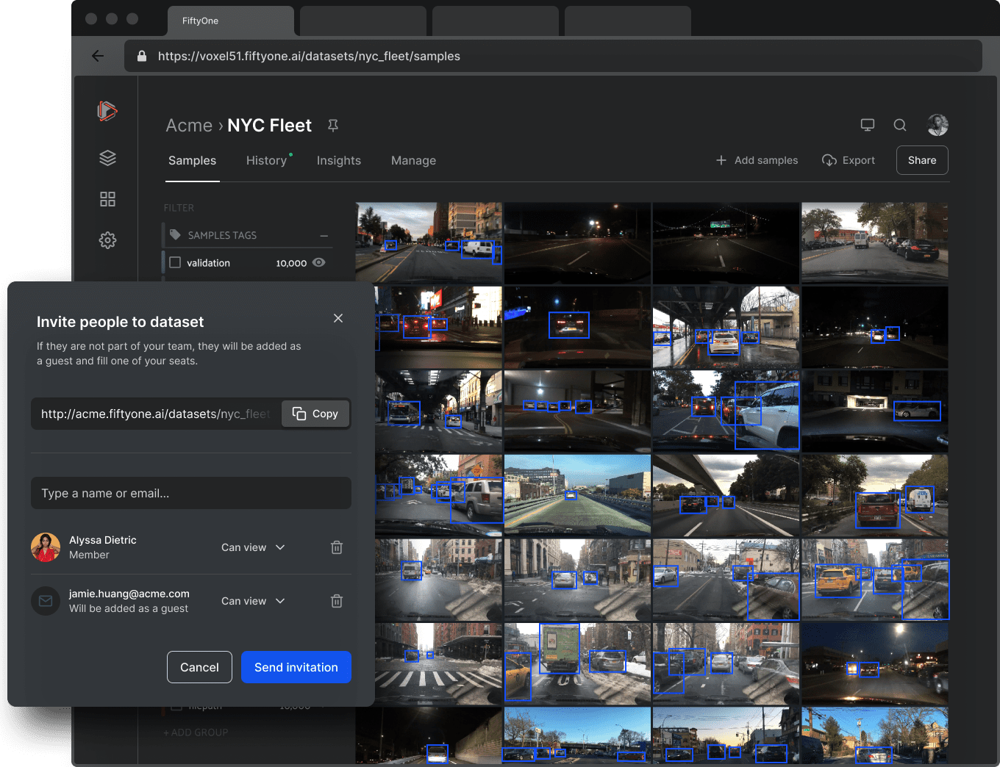

# FiftyOne Enterprise

<table id="social-links-table">
  <th>
    <a target="_blank" href="https://voxel51.com/enterprise">
      
      &nbsp Learn more
    </a>
  </th>
  <th>
    <a target="_blank" href="https://voxel51.com/book-a-demo/">
      
      &nbsp Talk to us
    </a>
  </th>
  <th>
    <a target="_blank" href="https://try.fiftyone.ai">
      
      &nbsp Try it now
    </a>
  </th>
</table>

[FiftyOne Enterprise](https://voxel51.com/enterprise/) enables multiple users\
to securely collaborate on the same datasets and models, either on-premises or\
in the cloud, all built on top of the open source FiftyOne workflows that\
you're already relying on.

FiftyOne Enterprise is fully backwards-compatible with the[open source project](https://github.com/voxel51/fiftyone), so all other\
pages on this site apply to Enterprise deployments as well.

|br|

<figure><figcaption></figcaption></figure>

### Features

<table data-view="cards"><thead><tr><th></th><th data-hidden data-card-cover data-type="files"></th><th data-hidden data-card-target data-type="content-ref"></th></tr></thead><tbody><tr><td><strong>Overview</strong> What's FiftyOne Enterprise? We think you'll be glad you asked! </td><td></td><td><a href="overview.html">overview.html</a></td></tr><tr><td><strong>Installation</strong> Learn how to install the FiftyOne Enterprise Python SDK. </td><td></td><td><a href="installation.html">installation.html</a></td></tr><tr><td><strong>Cloud-backed media</strong> Integrate FiftyOne Enterprise with your media stored in the cloud. </td><td></td><td><a href="cloud_media.html">cloud_media.html</a></td></tr><tr><td><strong>Roles and permissions</strong> Learn how to configure roles, groups and access permissions for users of your deployment. </td><td></td><td><a href="roles_and_permissions.html">roles_and_permissions.html</a></td></tr><tr><td><strong>Dataset Versioning</strong> Explore or revert to historical snapshots of your FiftyOne Enterprise datasets. </td><td></td><td><a href="dataset_versioning.html">dataset_versioning.html</a></td></tr><tr><td><strong>FiftyOne Enterprise App</strong> See how you can collaboratively work on datasets in the FiftyOne Enterprise App. </td><td></td><td><a href="app.html">app.html</a></td></tr><tr><td><strong>Data Lens</strong> Use FiftyOne Enterprise to explore and import samples from external data sources. </td><td></td><td><a href="data_lens.html">data_lens.html</a></td></tr><tr><td><strong>Data Quality</strong> Automatically scan your data for quality issues and take action to resolve them. </td><td></td><td><a href="data_quality.html">data_quality.html</a></td></tr><tr><td><strong>Model Evaluation</strong> Evaluate your models and interactively and visually analyze their performance. </td><td></td><td><a href="../user_guide/app.html#app-model-evaluation-panel">app.html</a></td></tr><tr><td><strong>Query Performance</strong> Configure your massive datasets to support fast queries at scale. </td><td></td><td><a href="query_performance.html">query_performance.html</a></td></tr><tr><td><strong>Plugins</strong> Learn how to install and manage shared plugins for your Enterprise deployment. </td><td></td><td><a href="plugins.html">plugins.html</a></td></tr><tr><td><strong>Secrets</strong> Safely store and access secrets in your Enterprise deployment. </td><td></td><td><a href="secrets.html">secrets.html</a></td></tr><tr><td><strong>Management SDK</strong> Learn how to programmatically manage your deployment with the Management SDK. </td><td></td><td><a href="management_sdk.html">management_sdk.html</a></td></tr><tr><td><strong>Migrations</strong> Learn how to migrate to FiftyOne Enterprise and manage your Enterprise deployment. </td><td></td><td><a href="migrations.html">migrations.html</a></td></tr></tbody></table>


Look interesting?


\[Schedule a demo]\(https://voxel51.com/book-a-demo) to get\
started with FiftyOne Enterprise

### Table of Contents

*   [Overview](overview/)

    Installation API connection \<api\_connection>\
    Cloud-backed media \<cloud\_media>\
    Roles and permissions \<roles\_and\_permissions>\
    Dataset Versioning \<dataset\_versioning>\
    App Data Lens **SUB\_NEW** \<data\_lens>\
    Data Quality **SUB\_NEW** \<data\_quality>\
    Query Performance **SUB\_NEW** \<query\_performance>\
    Plugins Secrets Management SDK \<management\_sdk>\
    Migrations Pluggable Auth \<pluggable\_auth>
