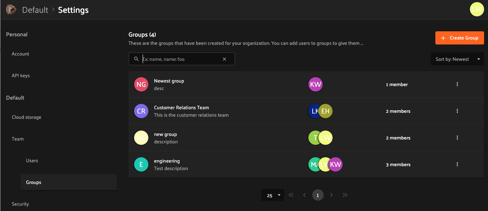
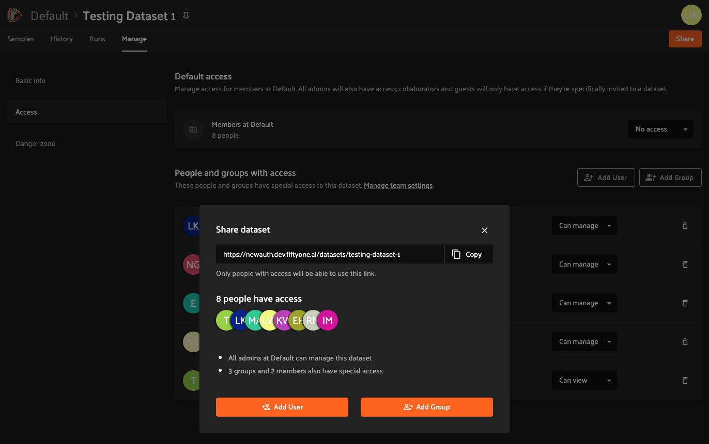
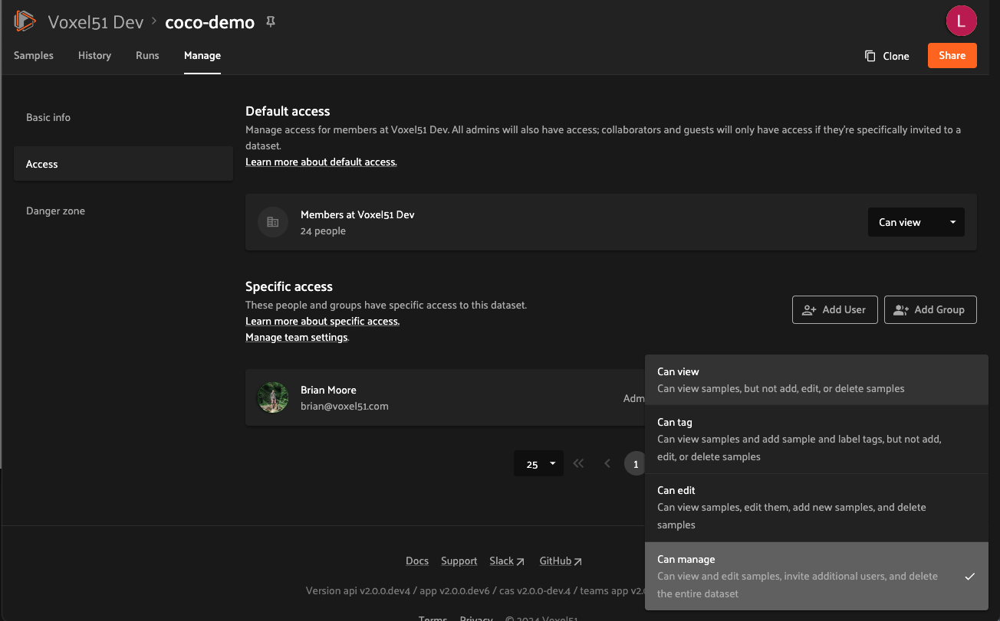

# Roles and permissions

FiftyOne Enterprise is built for collaboration, with the goal of making it as easy\
as possible for engineers, data scientists, and stakeholders to work together\
to build high quality datasets and computer vision models.

Accordingly, FiftyOne Enterprise gives you the flexibility to configure user roles,\
user groups and fine-grained permissions so that you can safely and securely\
collaborate both inside and outside your organization at all stages of your\
workflows.

This page introduces the basic roles and permissions available in\
FiftyOne Enterprise.

.. \_enterprise-roles:

#### Roles

FiftyOne Enterprise has four user roles: Admin, Member, Collaborator, and Guest.

Admins can access user management features by clicking on their account icon in\
the upper-right of the FiftyOne Enterprise App and navigating to the\
"Settings > Team > Users" page:

<figure><figcaption></figcaption></figure>

Admins can invite new users by clicking on "Invite people", as shown below.\
Invited users will receive an email invitation with a link to accept the\
invitation.


Invited users may login using any identity provider that has been enabled on your


deployment. If you need more information about configuring IdPs or increasing\
your user quotas, contact your Voxel51 CS engineer.

<figure><figcaption></figcaption></figure>

.. \_enterprise-admin:

### Admin

Admins have full access to all of an organization's datasets and can\
create, edit, and delete any dataset.

Admins can also invite or remove users from the organization and change any\
other user's roles, including promoting/demoting users to admins.

.. \_enterprise-member:

### Member

Members can create new datasets and can be granted any desired level of\
permission on existing datasets. Members may also have a[default access level](enterprise-default-access/) to datasets that use this\
feature.

Members do not have the ability to see or manage an organization's users.

.. \_enterprise-collaborator:

### Collaborator

Collaborators only have access to datasets to which they have been specifically\
granted access (a dataset's[default access level](enterprise-default-access/) does not apply to\
Collaborators), and they may only be granted **Can view**, **Can tag**\
or **Can edit** access to datasets.

Collaborators cannot create new datasets, clone existing datasets, or view\
other users of the deployment. Collaborators may export datasets to which\
they've been granted access.

.. \_enterprise-guest:

### Guest

Guests only have access to datasets to which they have been specifically\
granted access (a dataset's[default access level](enterprise-default-access/) does not apply to Guests),\
and they may only be granted **Can view** access to datasets.

Guests cannot create new datasets, clone existing datasets, export datasets, or\
view other users of the deployment.

.. \_enterprise-groups:

### Groups

User groups in FiftyOne Enterprise allow organization admins to manage a collection\
of users as a single entity. This simplifies the process of assigning\
permissions to multiple users, making it more efficient to control access to\
datasets.

Admins can manage groups through the "Settings > Team > Groups" page.\
Each group can be given specific dataset access permissions, which apply to\
all users within the group. Collaborators' and guests' access to the dataset is\
limited by the maximum dataset access level of the role.

<figure><figcaption></figcaption></figure>

Admins can create a new group by clicking on "Create group" and then adding\
existing users to the group by clicking on "Add users".

<figure><figcaption></figcaption></figure>

<figure><figcaption></figcaption></figure>


Non-existing users cannot be directly added to a group. Users must be


invited and accept the invitation before they can be added to a group.

.. \_enterprise-permissions:

#### Permissions

Admins and users with the **Can manage** permission on a dataset can configure\
a dataset's permissions under the dataset's[Manage tab](enterprise-managing-datasets/) in the FiftyOne Enterprise App.

In FiftyOne Enterprise, dataset permissions for a user are determined by both the\
access they receive from their groups' permissions and individual permissions\
assigned to them.

A user’s permissions on a dataset is the maximum of their permissions from the\
following sources:

* Admins implicitly have full access to all datasets
* Members have the dataset's[default access level](enterprise-default-access/)
* Users may be granted [specific access](enterprise-specific-access/) to the\
  dataset
* Users may be members of one or more groups, each of which may have[specific access](enterprise-specific-access/) to the dataset


User role determines the highest level of access that a user can be granted


to a dataset. For example, a user with Guest role can be added to a group\
with **Can edit** permission to a dataset, but this user will have**Can view** permission instead of **Can edit** permission of the dataset,\
because Guest role only allows **Can view** permission to datasets.

.. \_enterprise-default-access:

### Default access

All datasets have a default access level, which defines a minimum permission\
level that all Members have on the dataset.

A dataset's default access level can be set to **No access**, **Can view**,**Can tag**, **Can edit**, or **Can manage** as shown below:

<figure><figcaption></figcaption></figure>


Default access level only applies to Members. Guests and Collaborators must


be granted [specific access](enterprise-specific-access/) to datasets.

.. \_enterprise-specific-access:

### Specific access

Authorized users can grant specific access to a dataset using the "People and\
groups with access" section shown below.

To give access to an existing user or group, simply click "Share" button on\
the top right. A list of users with access to the dataset is shown. Click\
"Add User" or "Add Group" to grant access to a new user or group.

<figure><figcaption></figcaption></figure>

<figure><figcaption></figcaption></figure>

The following permissions are available to each user role:

* Groups may be granted **Can view**, **Can tag**, **Can edit**,\
  or **Can manage** permissions
* Members may be granted **Can view**, **Can tag**, **Can edit**,\
  or **Can manage** permissions
* Collaborators may be granted **Can view**, **Can tag**,\
  or **Can edit** permissions
* Guests may be granted **Can view** permissions


Authorized users can use the "Grant access" workflow to give **Can view**


, **Can tag**, or **Can edit** access to a dataset to an email address that\
is not yet user of a FiftyOne Enterprise deployment.

When the invitation is accepted, the user will become a Guest if the**Can view** permission is chosen or a Collaborator if a higher permission\
is chosen, and an Admin can upgrade this user to another role if desired via\
the Team Settings page.

.. \_enterprise-no-access:

### No access

If a user has no access to a dataset, the dataset will not appear in the user's\
search results or show on their dataset listing page. Any direct links to this\
dataset that the user attempts to open will show a 404 page.

.. \_enterprise-can-view:

### Can view

A user with **Can view** permissions on a dataset can find the dataset from\
their dataset listing page.

Users with **Can view** permissions cannot modify the dataset in any way, for\
example by adding or removing samples, tags, annotation runs, brain runs, etc.


Members (but not Guests or Collaborators) with **Can view** access to a


dataset may clone the dataset.

.. \_enterprise-can-tag:

### Can tag

A user with **Can tag** permissions on a dataset can find the dataset from\
their dataset listing page.

Users with **Can tag** permissions can modify sample/label tags but cannot\
modify the dataset in any other way.

.. \_enterprise-can-edit:

### Can edit

A user with **Can edit** permissions on a dataset has all permissions from**Can view** and, in addition, can modify the dataset, including:

* Adding, editing, and deleting samples
* Adding, editing, and deleting tags
* Adding and deleting annotation runs, brain runs, etc.


Deleting a dataset requires the **Can manage** permission.


.. \_enterprise-can-manage:

### Can manage

A user with **Can manage** permissions on a dataset has all permissions from**Can view**, **Can tag** and **Can edit** and, in addition, can delete the\
dataset and configure the permissions on the dataset of other users.

Remember that all admins can implicitly access and manage all datasets created\
on your team's deployment.


Any member who creates a dataset (including cloning an existing dataset or


view) will be granted \*\*Can manage\*\* permissions on the new dataset.

.. \_enterprise-roles-page:

#### Roles page

Admins can review the actions and permissions available to each user role by\
navigating to the "Settings > Security > Roles" page:

<figure><figcaption></figcaption></figure>
